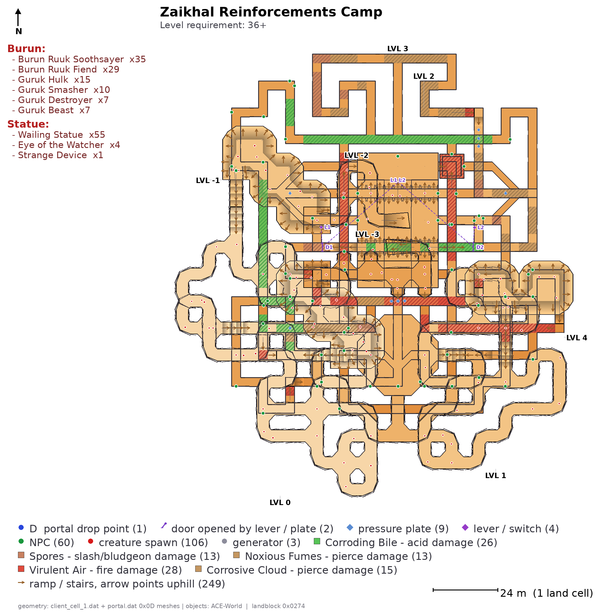

# landblock

Generates annotated dungeon maps for Asheron's Call, straight from the game
data. Nothing is hand-authored: floor plans and walls come out of the client
`.dat` files, and every object, name, level requirement, monster roster and
loot list is derived from an ACE-World database.



Runs on any client era. The dat formats did not change between 2005 and end of
retail, and the parsers are strict — they raise rather than guess — so a format
drift would surface immediately instead of quietly producing wrong maps.

---

## Quick start

```bash
pip install -r requirements.txt

python -m landblock \
    --cell    /path/to/client_cell_1.dat \
    --portal  /path/to/client_portal.dat \
    --world   /path/to/ACE-World/Database \
    --patches /path/to/ACE-World-Patches/Database/Patches \
    --out     maps \
    --all --dungeons-only
```

That writes one PNG per dungeon plus `index.csv` and `index.html`.

A single dungeon, by landblock id:

```bash
python -m landblock --cell ... --portal ... --world ... \
                    --out maps --landblock 01F5
```

### What you need

| Input | Where it comes from | Required |
|---|---|---|
| `client_cell_1.dat` | your AC client install | yes — dungeon geometry |
| `client_portal.dat` | your AC client install | yes — room meshes, terrain palette |
| ACE-World `Database/` | github.com/ACEmulator/ACE-World | yes — every object on the map |
| ACE-World patches | the matching patches repo | optional, strongly recommended |

The two dats live in your client folder. Point `--world` at the directory that
contains `3-Core/`. If you are using the 16 P.Y. world database, add
`--patches` as well: base 16PY covers about 2,685 landblocks and the patches
add roughly 579 more along with 6,400 updated weenies.

First run builds a weenie index (about 15 s for 44,000 weenies) and caches it
next to the SQL tree, so later runs start in about a second. Use
`--cache somewhere.json` to put it elsewhere.

A full end-of-retail run is about 1,000 dungeons, 25 minutes, and 200 MB.

---

## Options

```
--all                    every landblock with interior cells
--landblock HEX          one landblock, repeatable (e.g. --landblock 01F5)
--dungeons-only          skip caves, buildings and housing (see below)
--min-cells N            ignore trivial interiors (default 8)

--layout composite       one plan per dungeon (default via auto)
--layout panels          one titled panel per floor, on a grid
--layout flow            every floor in clear space, cut corridors numbered
--layout auto            composite unless floors genuinely stack

--scale N                pixels per metre (default 8)
--style dungeon|maze     orange plan, or the blue maze look
--no-walls               skip interior walls
--no-labels              markers only, no text
--generators             show monster and item generators
--obstacles              show static scenery from the cell meshes
--voids                  shade cells that appear to have no walkable floor
--debug-cells            overlay every cell id: F = has floor, C = cap only
--skip-existing          resume an interrupted batch
```

---

## What "dungeon" means here

`--dungeons-only` keeps landblocks with **no physical way in**. A cave or a
building sits in a landblock that also has objects standing on the surface; a
house has hooks, storage and a slumlord. A dungeon has neither — you arrive by
portal or by a transport spell.

On end-of-retail data that splits 3,409 interiors into:

| | count |
|---|---|
| dungeons | 1,016 |
| caves and buildings | 993 |
| housing | 700 |
| under 8 cells | 599 |
| no object data | 101 |

Of the dungeons, 880 have a portal pointing at them and 136 do not — those are
the spell-only ones.

---

## What ends up on a map

**Plan** — floors drawn from real floor polygons, interior walls from the
vertical faces of the same meshes. Ramps and stairs are shaded dark-to-light
with an arrow pointing uphill. Damage floors are coloured by damage type and
named for the weenie that creates them, so a lava bed reads as
`"Mag-Ma!" - fire damage` and a grate reads as `Hot Air - minor fire`. Bridges
and overpasses are hatched.

**Markers** — portal drop points (**D**) and exits (**E**), locked doors with a
key glyph, doors wired to a lever or plate numbered **D1/L1** with a dashed
line to the opener, chests, traps, pressure plates, levers, items on the
ground, NPCs, creature spawns and lifestones.

**Chrome** — dungeon name, entry chain, level requirement, quest flag, surface
entrance coordinates, nearest lifestone, exits, a monster roster grouped by
creature type, boss drop lists, legend, north arrow and a scale bar in metres.

Names that repeat more than three times are not labelled on the plan — a
dungeon with 55 Wailing Statues gets one roster line instead of 55 labels — and
when a dungeon holds more than ten NPCs none are labelled.

---

## How the interesting parts work

**Floors, not z-bands.** Levels come from the cell portal graph, not from
`z / 6`. Flat cells whose surfaces touch are one floor. A ramp belongs to the
floor at its lower end, because a ramp is how you leave a floor rather than
part of two. Fragments under ten cells — doorway stubs, stair landings — are
absorbed into whichever floor they connect to most. Groups are then merged when
they share most of their footprint and sit within one storey of each other: a
hall can have a lava bed, a walkway and a gallery at 6 m spacing, and that is
one space seen at three heights, not three floors. On Aerfalle Keep this turns
twelve z-bands into six floors. Floors are numbered relative to the arrival
point, so the drop is always LVL 0.

**Walls.** Every vertical polygon in a cell projects to a segment in plan.
Doorway quads are excluded by matching each polygon against the cell's portal
list — without that filter every cell boundary draws as a wall and an open hall
comes out as a grid.

**Metres.** One world unit is one metre. ACE compares `Location.DistanceTo`
directly against a missile cap documented as `85.0f / MetersToYards`, and a
terrain cell's `squareLength` is 24, so the scale bar reads 24 m.

**Shells.** A floor with nothing on it that sits almost entirely inside the
footprint of other floors is a roof or an empty storey, and drawing it just
buries what it covers. Those are dropped before compositing; `--keep-shells`
disables that.

---

## Using it as a library

```python
from landblock import Dat, Geometry, World, render_map, load_enums

load_enums('landblock/enums.json')
geom  = Geometry(Dat('client_cell_1.dat'), Dat('client_portal.dat'))
world = World('/path/to/ACE-World/Database')

cells        = geom.load(0x01F5)
insts, links = world.instances(0x01F5)
render_map(0x01F5, cells, insts, links, world, 'aerfalle.png')
```

`Dat` alone is a usable reader for any AC dat file, and
`geom.read_environment` parses `0x0D` meshes.

---

## Files

| | |
|---|---|
| `landblock/dat.py` | dat container: header, B-tree directory, block chains |
| `landblock/geom.py` | EnvCells, `0x0D` meshes, floors, walls, ramps |
| `landblock/world.py` | weenie index and landblock instances, base + patches |
| `landblock/render.py` | floor grouping, layout and drawing |
| `landblock/__main__.py` | command line |
| `landblock/enums.json` | WeenieType and CreatureType, exported from ACE |

---

## Verifying against a new client

The mesh parser raises unless every environment file consumes to the exact
byte, which makes it a usable smoke test:

```python
from landblock import Dat, read_environment
d = Dat('client_portal.dat')
for i in sorted(x for x in d.files if 0x0D000000 <= x <= 0x0D00FFFF):
    read_environment(d.get(i))      # raises on any mismatch
```

End-of-retail passes 772 of 772.

---

## Known limits

* Multi-landblock dungeons render as separate maps rather than being stitched.
* Town names are not available: ACE ships the `points_of_interest` schema but
  no rows, so "nearest town" cannot be derived.
* Nearest lifestone is straight-line distance, not travel distance.
* A handful of landblocks have geometry but no object data in any world
  database, and render as bare plans.
* `HAZARD_DAMAGE` in `render.py` decides whether a hotspot is a hazard or
  ambient scenery. At the default of 10, end-of-retail "Hot Air" (12 and 20
  damage) paints as a fire hazard rather than the grate it looks like in game.

## Credits

Dungeon geometry and meshes are read from the Asheron's Call client data files.
Object placements come from the ACEmulator ACE-World database. Formats were
transcribed from ACEmulator's `ACE.DatLoader`. Layout conventions are modelled
on the hand-drawn maps of the Asheron's Call mapping community.
